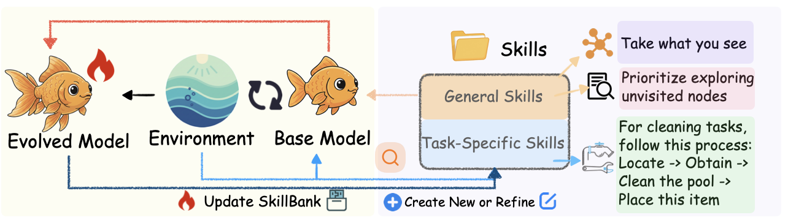

# SkillRL: Evolving Agents via Recursive Skill-Augmented Reinforcement Learning

<div align="center">

Bridging the gap between raw experience and policy improvement through automatic skill discovery.

</div>

<p align="center">

</p>

## 🔥 News

- **[02/23/2026]** We released all the model checkpoints on HuggingFace! Feel free to use them as warm starts for continued RL training.
- **[02/18/2026]** The code of SkillRL was released!
- **[02/10/2026]** SkillRL paper was released on [arXiv](https://arxiv.org/abs/2602.08234)!

## 📖 Overview

SkillRL is a framework that enables LLM agents to learn high-level, reusable behavioral patterns from past experiences. While traditional memory-based methods store redundant and noisy raw trajectories, SKILLRL abstracts these into a hierarchical skill library.

## 🤖 Key Features

- **Experience-based Skill Distillation**: Transforms successful trajectories into strategic patterns and failed ones into concise lessons from failure.

- **Hierarchical SKILLBANK**: Organizes knowledge into General Skills for universal strategic guidance and Task-Specific Skills for category-level heuristics.

- **Recursive Skill Evolution**: A dynamic mechanism where the skill library co-evolves with the agent's policy during RL by analyzing validation failures.

- **Context Efficiency**: Achieves 10-20% token compression compared to raw trajectory storage while enhancing reasoning utility. 

---

## 📥 Model Download

You can directly download the model weights by following the links below.

<table>
  <thead>
    <tr>
      <th align="center">Task</th>
      <th align="center">Model</th>
      <th align="center">Download Link</th>
    </tr>
  </thead>
  <tbody>
    <tr>
      <td align="center" rowspan="2">🧭 ALFWorld</td>
      <td align="center">SFT Model</td>
      <td align="center"><a href="https://huggingface.co/Jianwen/Alfworld-7B-SFT">🤗 HuggingFace</a></td>
    </tr>
    <tr>
      <td align="center">RL Model</td>
      <td align="center"><a href="https://huggingface.co/Jianwen/Alfworld-7B-RL">🤗 HuggingFace</a></td>
    </tr>
    <tr>
      <td align="center" rowspan="2">🛍️ WebShop</td>
      <td align="center">SFT Model</td>
      <td align="center"><a href="https://huggingface.co/Jianwen/Webshop-7B-SFT">🤗 HuggingFace</a></td>
    </tr>
    <tr>
      <td align="center">RL Model</td>
      <td align="center"><a href="https://huggingface.co/Jianwen/Webshop-7B-RL">🤗 HuggingFace</a></td>
    </tr>
    <tr>
      <td align="center" rowspan="2">🔍 Search</td>
      <td align="center">SFT Model</td>
      <td align="center"><a href="https://huggingface.co/Jianwen/Search-7B-SFT">🤗 HuggingFace</a></td>
    </tr>
    <tr>
      <td align="center">RL Model</td>
      <td align="center"><a href="https://huggingface.co/Jianwen/Search-7B-RL">🤗 HuggingFace</a></td>
    </tr>
  </tbody>
</table>


---

## 🚀 Getting Started

### Installation

```bash
git clone https://github.com/aiming-lab/SkillRL.git
cd SkillRL

pip install -r requirements.txt
pip install vllm==0.11.0
pip install flash-attn==2.7.4.post1 --no-build-isolation --no-cache-dir
pip install -e .

pip install openai
```

### Environment Setup

**ALFWorld**
```bash
pip install alfworld
pip install gymnasium==0.29.1
pip install stable-baselines3==2.6.0

# Download PDDL & Game files and pre-trained MaskRCNN detector
alfworld-download -f
```

**WebShop**
```bash
cd agent_system/environments/env_package/webshop
./setup.sh -d all
```

**Search**
```bash
cd agent_system/environments/env_package/search/third_party
pip install -e .
pip install gym==0.26.2
```

**API Setup**
```
export AZURE_OPENAI_API_KEY="..."
export AZURE_OPENAI_ENDPOINT=""
```

---

## 🏃 Training

### Memory Data Generation
The first step of our training pipeline uses the base model to generate memory data. This data serves as the foundation for the agent's initial ex∏≈πeriences. The specific prompt used to guide this generation can be found at: `memory_data/prompt/prompt.txt`.

### Supervised Fine-Tuning (SFT)
Prior to RL, we perform SFT to endow the model with basic task capabilities and instruction-following alignment. We use [LLaMA-Factory](https://github.com/hiyouga/LlamaFactory) as our framework for the SFT stage.

### RL With SkillBank

#### Template Mode

Template mode uses keyword matching to detect the task category and injects all skills for that category into the prompt.  No embedding model is required.

```bash
# ALFWorld
export MODEL_PATH=YOUR_SFT_CKPT
bash examples/grpo_trainer/run_alfworld_skills.sh

# WebShop
bash examples/grpo_trainer/run_webshop_skills.sh

# Search
bash examples/grpo_trainer/run_search_skills.sh
```

Key config flags added by these scripts:

```
+env.use_skills_only_memory=True
+env.skills_only_memory.skills_json_path=memory_data/alfworld/claude_style_skills.json
+env.skills_only_memory.top_k=6              
+env.skills_only_memory.enable_dynamic_update=True
+env.skills_only_memory.update_threshold=0.4
+env.skills_only_memory.max_new_skills=3
```

#### Embedding Mode

Embedding mode uses [Qwen3-Embedding-0.6B](https://huggingface.co/Qwen/Qwen3-Embedding-0.6B) to rank skills by semantic similarity to the task description.  Both general skills and task-specific skills are searched cross-category and only the top-k most relevant are injected.  Skill embeddings are pre-computed once at startup.

```bash
export MODEL_PATH=YOUR_SFT_CKPT

python3 -m verl.trainer.main_ppo \
    ... \
    +env.use_skills_only_memory=True \
    +env.skills_only_memory.skills_json_path=memory_data/alfworld/claude_style_skills.json \
    +env.skills_only_memory.retrieval_mode=embedding \
    +env.skills_only_memory.embedding_model_path=Qwen/Qwen3-Embedding-0.6B \
    +env.skills_only_memory.top_k=6 \
    +env.skills_only_memory.task_specific_top_k=5
```

---

## ⚙️ Skill Memory Configuration

All parameters live under `env.skills_only_memory.*` (Hydra / OmegaConf).

| Parameter | Type | Default | Description |
|---|---|---|---|
| `skills_json_path` | str | — | **Required.** Path to the skills JSON. |
| `retrieval_mode` | str | `"template"` | `"template"` or `"embedding"`. |
| `embedding_model_path` | str | `"Qwen/Qwen3-Embedding-0.6B"` | Local path or HF model ID.  Only used when `retrieval_mode=embedding`. |
| `top_k` | int | `6` | Number of general skills injected per episode. |
| `task_specific_top_k` | int | `None` | Max task-specific skills per episode.  `None` = all (template) / same as `top_k` (embedding). |
| `enable_dynamic_update` | bool | `False` | Evolve the skill bank during training using validation failures. |
| `update_threshold` | float | `0.4` | Min success rate below which skills are updated. |
| `max_new_skills` | int | `3` | Maximum new skills added per update cycle. |
---

## 📋 Skill Bank Format

Skills are stored in a JSON file with three top-level keys:

```json
{
  "general_skills": [
    {
      "skill_id": "gen_001",
      "title": "Systematic Exploration",
      "principle": "Search every plausible surface exactly once …",
      "when_to_apply": "Anytime the goal object count is not yet met …"
    }
  ],
  "task_specific_skills": {
    "pick_and_place": [
      {
        "skill_id": "pnp_001",
        "title": "Direct Path Planning",
        "principle": "Navigate directly to the target receptacle …",
        "when_to_apply": "After picking up the object …"
      }
    ],
    "clean": [ … ],
    "heat":  [ … ]
  },
  "common_mistakes": [
    {
      "mistake_id": "err_001",
      "description": "Repeating the same action after it fails.",
      "why_it_happens": "Agent does not track action history.",
      "how_to_avoid": "Check the admissible actions list and try an alternative."
    }
  ]
}
```

### Generating a New Skill Bank

Use the provided generation scripts (requires Azure API access):

```bash
# ALFWorld
python skill_generation/alfworld.py \
    --memory_path memory_data/alfworld/generated_memories_alfworld_total.json \
    --output_path memory_data/alfworld/claude_style_skills.json

# WebShop
python skill_generation/webshop.py \
    --memory_path memory_data/webshop/generated_memories_webshop_100.json \
    --output_path memory_data/webshop/claude_style_skills.json

# Search
python skill_generation/search.py \
    --memory_path memory_data/webshop/generated_memories_webshop_100.json \
    --output_path memory_data/webshop/claude_style_skills.json
```

---

## 📚 Citation
If you find our work helpful, please consider citing:

```bibtex
@article{xia2026skillrl,
  title={SkillRL: Evolving Agents via Recursive Skill-Augmented Reinforcement Learning},
  author={Xia, Peng and Chen, Jianwen and Wang, Hanyang and Liu, Jiaqi and Zeng, Kaide and Wang, Yu and Han, Siwei and Zhou, Yiyang and Zhao, Xujiang and Chen, Haifeng and others},
  journal={arXiv preprint arXiv:2602.08234},
  year={2026}
}
```

## 🙏 Acknowledgement
We would like to express our gratitude to the open-source community and the following projects for making this work possible: 
[verl-agent](https://github.com/langfengQ/verl-agent), [LLaMA-Factory](https://github.com/hiyouga/LlamaFactory), [Qwen](https://github.com/QwenLM/Qwen), etc.
